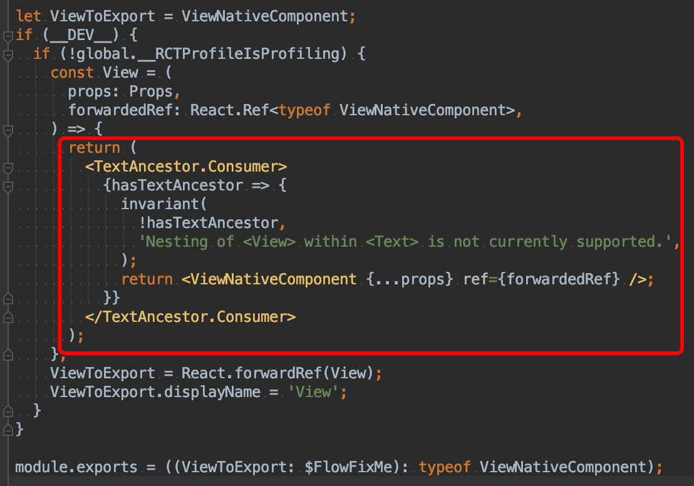
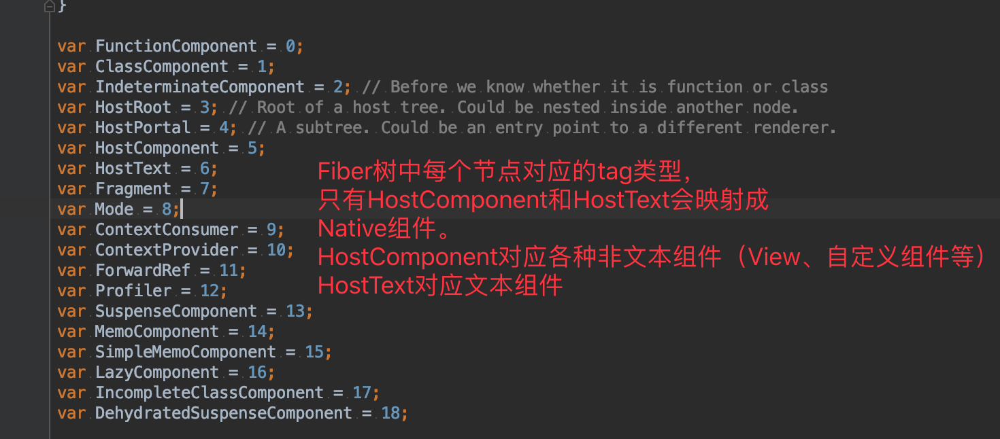
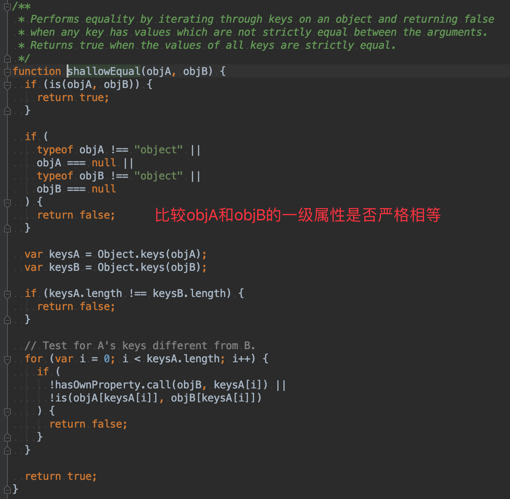

<!--# React源码解析-->

admindeMacBook-Pro-5:react-devtools-core shengshuqiang$ pwd
/Users/shengshuqiang/work/react-devtools/packages/react-devtools-core
admindeMacBook-Pro-5:react-devtools-core shengshuqiang$ yarn run standalone

admindeMacBook-Pro-5:react-devtools shengshuqiang$ pwd
/Users/shengshuqiang/work/react-devtools/packages/react-devtools
admindeMacBook-Pro-5:react-devtools shengshuqiang$ npm start

# 考考你

1. <blockquote>问：明明只写了几个组件，通过React DevTools看到的是一堆布局，而且还有Context.Consumer，这哪来的，干啥的？ 答：查看View.js源码，发现里面会再次render出Context.Consumer。也就是我们写的<View/>最终生成的树是<blockquote>\<View><blockquote>\<Context.Consumer> \</Context.Consumer></blockquote>\</View></blockquote>。 同样，\<Text>\</Text>对应<blockquote>\<Text><blockquote>\<TouchableText><blockquote>\<Context.Consumer>\</Context.Consumer></blockquote>\</TouchableText></blockquote>\</Text></blockquote> 我们写的组件其实外面会被包裹一层，比方显示yellowbox提示啥的</blockquote>
2. <blockquote>问：React的组件和Native看起来好像不是一一对应的，这个映射策略是什么？ 答：<blockquote>1. 我们通过react-devtools看到的reactdom树不是完全的。下面是react-devtools上显示的：，文本节点没有，实际最外层还有一个HostRoot节点。</blockquote><blockquote>2. reactdom树中只有部分dom节点(宿主节点，对应文本和Native组件)是显示在界面上的，其他的并不展示。Fiber中的tag表示类型，创建NativeView时（createInstance和createTextInstance）的tag是组件唯一标识，从数字3开始累积2生成。</blockquote>。</blockquote>
3. <blockquote>问：都说React有个diffing算法，这个在代码哪里，怎么比较的，文案变了会设计diff算法吗？ 答：diffing算法在[reconciliation模块](https://zh-hans.reactjs.org/docs/reconciliation.html)里面，对应函数为ChildReconciler。，文本节点和数组见reconcileSingleTextNode和reconcileChildrenArray。更多可以参考[React 源码剖析系列 － 不可思议的 react diff](https://zhuanlan.zhihu.com/p/20346379)</blockquote>
4. <blockquote>问：浅比较shouldComponentUpdate说的是什么，到底应该怎么用？ 答：判断组件是否更新时调用，优先调用shouldComponentUpdate方法，无该该方法是判断是否是纯组件，是则浅比较（判断对象props和state前后是否改变，只对比一级属性是否严格相等===）。</blockquote>
5. <blockquote>问：React有棵DOM树，树在哪，怎么看，怎么操作Native的DOM树？ 答：。</blockquote>
6. <blockquote>问：setState到底干啥了？ 答：。</blockquote>
7. <blockquote>问：React高效在哪？ 答：可中断的树遍历算法；双树；。</blockquote>
8. <blockquote>问：React工作流程？ 答：。</blockquote>
9. <blockquote>问：如何关联Native自定义组件？ 答：。</blockquote>
10. <blockquote>问：每个Fiber节点存了什么信息，输入和输出是什么？ 答：。</blockquote>
	11. FiberNode
		12. stateNode
			12. HostRoot对应{containerInfo}
			13. ClassComponent对应为new的函数对象实例
			13. HostComponent对应为ReactNativeFiberHostComponent，包含_children和_nativeTag。
			14. HostText对应为nativeTag。
		12. elementType
			13. ClassComponent对应为函数，如APPContainer()。
			14. ForwardRef、ContextConsumer、ContextProvider对应为对象，如{$$typeof: Symbol(react.forward_ref), render: ƒ, displayName: "View"}。
			15. HostComponent对应为字符串，如“RCTView”。
			16. HostText对应为null。
			16. 
		13. memoizedProps
		14. memoizedState
		15. pendingProps
		16. effectTag
	17. instanceCache[tag] = hostInst; 缓存对应native view树的dom 树
	18. instanceProps[tag] = props;
	19. HostText和HostComponent才对应实体DOM节点
20. React和ReactDevTools通信
	21. React -> ReactDevTools
		22. React: backend.js ws.send(JSON.stringify(data));
		23. ReactDevTools: standalone.js socket.onmessage
	22. ReactDevTools -> React: 
23. 坑爹
	24. backend.js dehydrate.js LEVEL_THRESHOLD 导致数据解析错误

TODO 第一个断点处开始遍历看看如何执行？
commitAllHostEffects

# 参考

1. [React16源码之React Fiber架构](https://juejin.im/post/5b7016606fb9a0099406f8de)
2. [「译」React Fiber 那些事: 深入解析新的协调算法](https://juejin.im/post/5c052f95e51d4523d51c8300)
3. [200行代码实现简版react](https://juejin.im/post/5c0c7304f265da613e22106c)
2. [React 源码剖析系列 － 不可思议的 react diff](https://zhuanlan.zhihu.com/p/20346379)
3. [React源码分析](https://juejin.im/post/5abe05ea5188255c61631d6c)