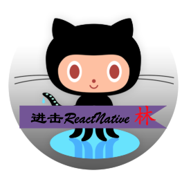
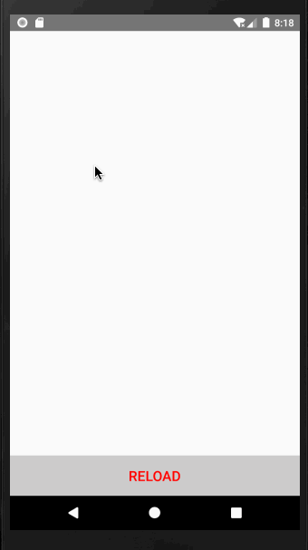
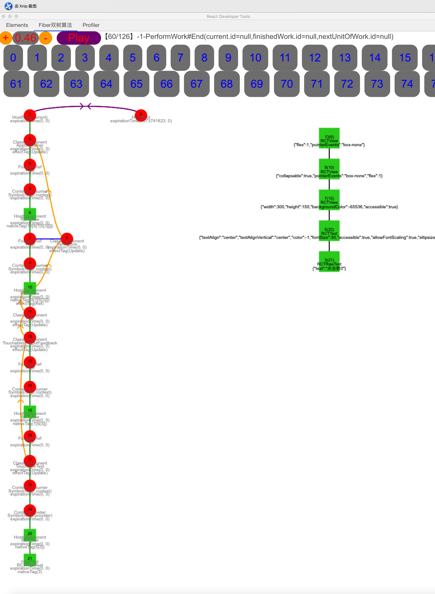
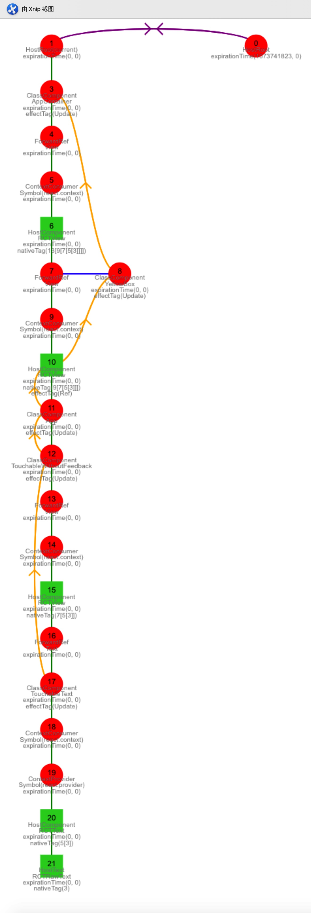
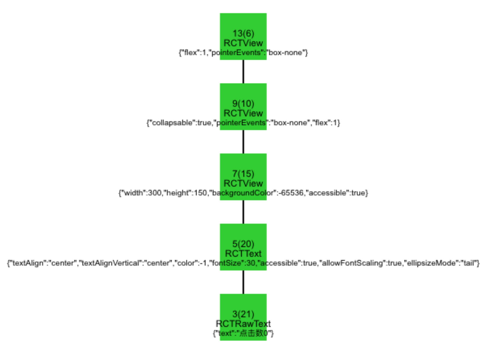
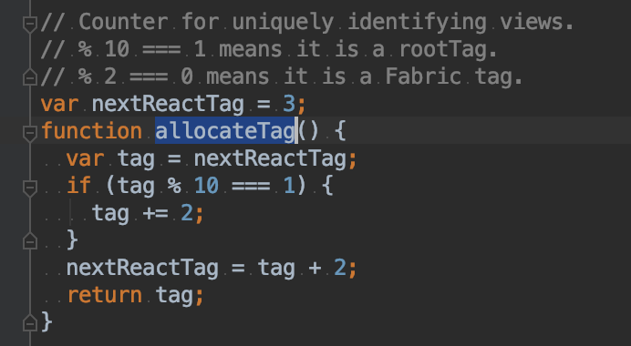
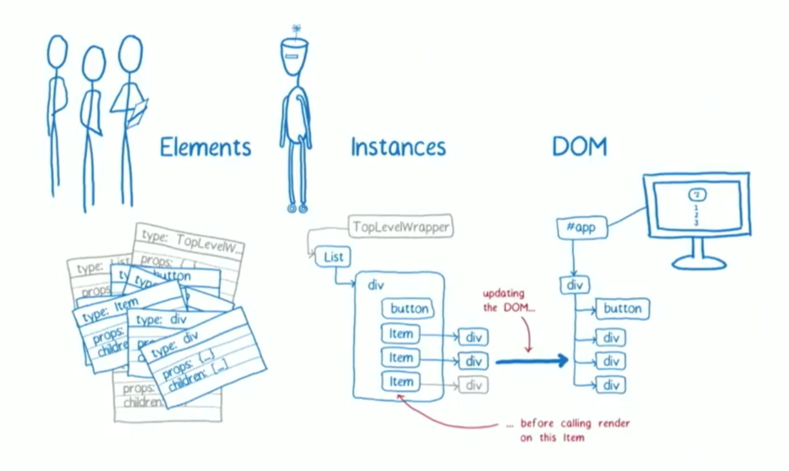
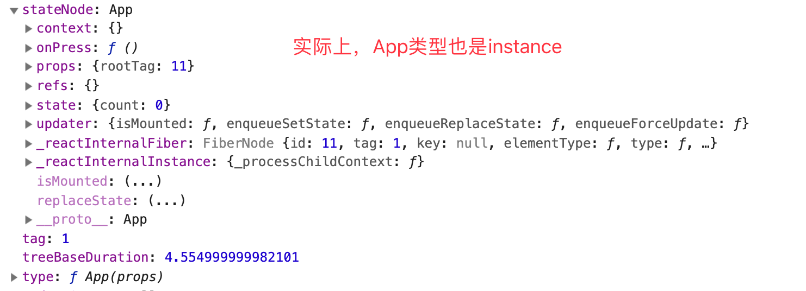
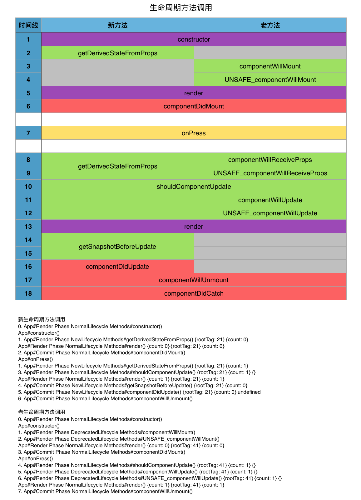

<!--# 进击ReactNative-徐如林-React源码解析 采扶桑 望帝乡 兵甲销为日月光-->



# 序

有的人可能会不理解，大前端跨平台的战火为谁而燃，吾辈何以为战？专注于移动互联网大前端致富，一直是我们最崇高的理想，而ReactNative是一个桥头堡。纵观行业风向，有作壁上观者，有磨刀霍霍者，有入门到放弃者，有大刀阔斧者，但是缺乏深潜微操者。哈，是时候该我出手了。祭出“大海航术”，经过一年来不懈钻研，基于React Developer Tools研发插件，实时绘制运行时三张图--Fiber双树图、Native View树图、React方法调用树图，在上帝视角和时间旅行的引领下，冲破波诡云谲的Fiber迷航，日照大海现双龙。

如果有对ReactNative不太熟悉的朋友，可以看一下我上篇文章[《进击ReactNative-疾如风》](https://shengshuqiang.github.io/2019/01/07/%E8%BF%9B%E5%87%BBReactNative-%E7%96%BE%E5%A6%82%E9%A3%8E.html)润润嗓子，该文从“原理+实践，现学现做”的角度手写石器时代ReactNative，了解整体跨平台套路，迂回包抄，相对比较轻松！本文则正面硬杠React源码，会略显烧脑。

做大事，就要用大斧头。先用[阿里“三板斧”](https://baijiahao.baidu.com/s?id=1609462546639223406&wfr=spider&for=pc)撼一下。

# 定目标

## 传道（攻坚方法论）

近几年移动互联网北漂，让我明白一个道：所谓经验，就是不断探索、抽象、践行、强化自己的方法论，呈发展的螺旋形式，“复盘总结”一直是快速成长的牛人居家旅行必备技能。我攻坚ReactNative的最大动力，就是借假修真，跨平台技术最终王者也许花落Flutter或者小程序（还有很多人在纠结到底哪家强，耽误了学习，其实这好比考清华还是考北大，Top2高校有那么难选么，真正难选的是Top3高校），这都不重要，我能举一，必能反三。这就是道，我旨在强化出一套跨界喜剧王的方法论，如何从0将ReactNative技能练到Android熟练度，并且同样适用于Flutter和小程序。


## 授业（懂算法）

现在市面上高水准解析ReactNative文章太少（老外写的硬核文章居多），而且大多停留在理论层面，只给出源代码片段，根本无法深入实操，只能作者说啥就是啥，反正不明觉厉。阅读源码的好处不言而喻，源码是唯一的真相和注释，学到的比你期望的多得多。


本文必须带你看到源码但不是做英语阅读，尽量做到：

1. **承上**（你的api怎么用的）
	* 生命周期调用时机
	* render干了什么
	* setState发生了什么
	* PureComponent比Component高在哪里，我们怎么能做到更高
1. **启下**（底层怎么处理的）
	* 深入浅出Fiber双树算法
	* diff算法
	* Native操作指令从哪来的

## 解惑（考考你）

爱思考的童靴会发现各种各样的问题，我也是。下面是我遇到的问题，需要一个满意的答复。

1. 明明只写了几个组件，通过React Developer Tools看到的是一堆布局，而且还有Context.Consumer，这些都是干啥的？
2. React的组件和Native看起来好像不是一一对应的，这个映射策略是什么？
2. Element、Instance、DOM之间关系？
2. 都说React有个diffing算法，这个在代码哪里，怎么比较的，文案变了会涉及diff算法吗？
3. 浅比较shouldComponentUpdate说的是什么，到底应该怎么用？
4. React有棵DOM树，树在哪，怎么看，怎么操作Native的DOM树？
5. setState到底干啥了？
6. React高效在哪？
7. React工作流程？
8. 如何关联Native自定义组件？
9. Fiber节点数据结构中各属性含义？？


# 追过程

## 三步曲

### 第一步（查资料）

网上一顿关键字搜索，站在前人的肩膀上，知道个大概，不要急，妥妥的数十篇深度文章以上，你的感觉才能来。这里给大家安利三篇文章（ReactNative优秀文章导读）和一个[微信朋友圈](https://shengshuqiang.github.io/about.html)。没错，就是我，不一样的烟火。发盆友圈，我是认真的。前面三篇文章是我盆友圈的汇集，这么说吧，发盆友圈是停不下来了，上一天班我就发一篇。

1. [进击ReactNative-纳百川](https://shengshuqiang.github.io/2018/12/15/%E8%BF%9B%E5%87%BBReactNative-%E7%BA%B3%E7%99%BE%E5%B7%9D.html)
2. [进击ReactNative-积土（React）山](https://shengshuqiang.github.io/2019/01/20/%E8%BF%9B%E5%87%BBReactNative-%E7%A7%AF%E5%9C%9F-React-%E5%B1%B1.html)
3. [进击ReactNative-积水（JavaScript）渊](https://shengshuqiang.github.io/2019/02/24/%E8%BF%9B%E5%87%BBReactNative-%E7%A7%AF%E6%B0%B4-JavaScript-%E6%B8%8A.html)

不间断的阅读输出，能获得很多启发，有助于修正强化方法论。比方说通过XMind自由缩放源码地图、DIY ReactNative、抽象伪代码表述等。过程中，我发现大家都在用一个有意思的卡通图。


卡通图来源React的美女程序员Lin Clark在2017年React大会的演讲视频截图，这个视频太棒了，建议大家看一看[Lin Clark - A Cartoon Intro to Fiber - React Conf 2017](https://www.bilibili.com/video/av40427580/)。

### 第二步（搭台子）

搭一个实验室--本地可运行环境（我的开发平台macOS，目标平台Android）。

1. 安装软件：Webstorm（前端开发环境）、AndroidStudio（Android开发环境，送Android模拟器）
2. 安装依赖：安装XCode（iOS开发环境，送iPhone模拟器）就顺带解决了
2. 使用 React Native 命令行工具来创建一个名为"AwesomeProject"的新项目：react-native init AwesomeProject
3. 欧了，简单demo(页面一个红色按钮，初始显示点击数n，点击切换为“汽车”图标)测试一下。
4. 
5. 配置详见[React Native 中文网-搭建开发环境](https://reactnative.cn/docs/getting-started.html)

### 第三步（上源码）

我们来读源码（ "react": "16.8.3","react-native": "0.59.8"）吧！ReactNative上层JS代码主要实现在node_modules/react-native/Libraries/Renderer/oss/ReactNativeRenderer-dev.js这一个文件，代码行数21194（区区2W，好像压力也没辣么大）。


我给自己的读码方法论命名为“大海航术”，简单说就是运行时日志辅助断点调试，再加上自己野兽般的想象力，达到能自圆其说，唬住不懂的人（包括我自己），假装懂了的套路。

对付简单的算法，这招基本够用，否则我也混不下去了。但是，Fiber算法，可不简单。第一个回合硬着头皮看下来，只知道一堆乱七八糟的调用，混杂着Fiber数据结构中的各种光怪陆离的属性，而且用到了复杂的双树数据结构，这些，小本子根本记不过来。来张我的笔记感受一下（不用细看，我也没打算讲这张图），一波操作下来，差不多要2天专注的投入，要是打断了，你都找不到北。


按这个套路，连Log加Debug带猜，发现装不下去了，这道题太难了。一度跌入绝望之谷。即使这样，我仍然尝试把源码看了三遍，仍然没什么收获，等着顿悟吧，直到那一天。。。

来个段子活跃一下。[《读懂圣殿骑士团，读懂现代银行的起源》](https://mp.weixin.qq.com/s?__biz=MzUzMjY0NDY4Ng==&mid=2247483854&idx=1&sn=bd82089baec16c3b7d2e96d57e8e5840&chksm=fab157efcdc6def9b4a890ba7894b6c440fd4b38923810f6bc27cbc71b549081e3c92c05328d&mpshare=1&scene=1&srcid=1020RvqHBV8LgoFciquJ4koA&sharer_sharetime=1571535764572&sharer_shareid=82c707e9022f9f44af256194c6fc9b1f&pass_ticket=PNCtDJj79ATAfJb0AYzGIeOribtLxFVNeuVyR9kwmBPpNQoMX6K0qv0q3H5sYMDq#rd)里面有个有意思的小故事，说欧洲国王和圣殿骑士团借钱打战，打赢了就把钱还上，没想到打输了，欠了一屁股债，脑子很活的法国国王就想：“可不可以不还钱”，随后的问题就是“不还钱会发生啥？”，进一步“不仅不还钱，而且杀鸡取卵，有问题吗？”能有啥问题，没问题，那就干。然后说圣殿骑士团搞基（因为圣殿骑士团徽章是两个人骑一匹马）犯法，于是砍死了债主，钱也就不用还了。

我受到了启发，也来个脑筋急转弯，能不能自己写个脚本把Fiber双树画出来，日志记录了算法的所有行为，但问题是可读性太差，上万条日志能联系起来推理，猴哥都不一定能做到，况且我又不是猴子，是时候生产工具鸟枪换炮了。说干就干，我将日志中的Fiber双树用JS脚本画了出来。

[](./DrawFiber/drawfiber.html)

上面Demo，初始化渲染有60步，我这么一步步复制数据生成Fiber树图片，这和猴子也没啥区别。这时，我想起来了好基友李阳推荐的React Developer Tools工具、恰巧彼时团队内部也有童靴在扩展该工具。我能不能写个插件，实时绘制运行时Fiber双树图。虽说是扩大战果，但也可能被拖入新的泥潭，舍本逐末。幸好运气不错，在瓶颈期通过董思文和陈卓双大牛的点拨下，插件也给我搞出来了。



这里必须给React Developer Tools点32个赞，这是我迄今见过最好的架构，我就一JS倔强青铜的水平，竟然看着文档能把源码跑起来（过程中编译相关小问题找大牛给解了），进一步把自己的脚本集成进去，模仿已有脚本一顿Ctrl+F、Ctrl+C、Ctrl+V就成了，延展性可见一斑，不服不行。

上面截图可以看到，插件里面有两棵树（Fiber双树和Native View树）和一堆数字按钮。数字按钮对应每一步，点击按钮即可完成时间旅行。光凭这两颗树，还是要靠日志像猴子一样手动映射源码，我才不做猴子呢。在此之上，我继续绘制实时方法调用树（看着有点像抽象语法树，但是只有我这么用）。


## 大海航术

终于到了压轴环节，上大海航术动图。


受限于屏幕大小，无法鸟瞰全貌，后续考虑直接生成一个网页。

React源码解析，需要牢记：React组件是数据的函数，v = f(d)。抓住输入和输出，才能有的放矢。本次解析分为二段，初始渲染时间线（用户进入页面Fiber算法干啥类）、用户点击渲染时间线（用户点击按钮切换文本为图标，Fiber算法又干啥类）。这两个场景是所有Fiber算法行为的本源，万变不离其宗。然后再用简单伪代码回顾一下。

### 初始渲染时间线

**初始化页面布局**(里面有一堆组件，远比我们写的要多)


**初始化JS2Native通信**(通信主要是通过桥UIManager调用createView创建、setChildren关联（增删改）和updateView更新)

	1. invoke    UIManager.createView    [3,"RCTRawText",11,{"text":"点击数0"}]
	2. invoke    UIManager.createView    [5,"RCTText",11,{"ellipsizeMode":"tail","allowFontScaling":true,"accessible":true,"fontSize":30,"color":-1,"textAlignVertical":"center","textAlign":"center"}]
	3. invoke    UIManager.setChildren    [5,[3]]
	4. invoke    UIManager.createView    [7,"RCTView",11,{"backgroundColor":-65536,"height":150,"width":300,"accessible":true}]
	5. invoke    UIManager.setChildren    [7,[5]]
	6. invoke    UIManager.createView    [9,"RCTView",11,{"flex":1,"pointerEvents":"box-none","collapsable":true}]
	7. invoke    UIManager.setChildren    [9,[7]]
	8. 
	9. invoke    UIManager.createView    [13,"RCTView",11,{"pointerEvents":"box-none","flex":1}]
	10. invoke    UIManager.setChildren    [13,[9]]
	11. 
	12. invoke    UIManager.setChildren    [11,[13]]


**初始化Fiber树**


**初始化NativeView树**


**手机横过来看**

[	](./React算法初始渲染时间线-横版.png)

### 用户点击渲染时间线

**用户点击页面组件布局**


**用户点击JS2Native通信**，

    1. invoke    UIManager.measure    [7,27]
    1. invoke    UIManager.playTouchSound    []
    2. invoke    UIManager.createView    [15,"RCTImageView",11,{"loadingIndicatorSrc":null,"defaultSrc":null,"src":[{"uri":"http://demo.sc.chinaz.com/Files/pic/icons/5918/c12.png"}],"shouldNotifyLoadEvents":false,"opacity":0.85,"overflow":"hidden","height":100,"width":100}]
    3. invoke    UIManager.manageChildren    [7,[],[],[],[],[0]]
    4. invoke    UIManager.manageChildren    [7,[],[],[15],[0],[]]
    5. invoke    UIManager.updateView    [7,"RCTView",{"backgroundColor":-16777216}]
    1. invoke    UIManager.updateView    [15,"RCTImageView",{"opacity":null}]
    2. invoke    UIManager.updateView    [7,"RCTView",{"backgroundColor":-65536}]

**用户点击Fiber树**


**初始化NativeView树**


**手机横过来看**

[](./React算法用户点击渲染时间线-横版.png)

### 小结

#### 简约伪代码

```
function ReactNativeRenderer_render() {
    const ClassComponent = 1;
    const HostComponent = 5;
    const HostText = 6;
    const Snapshot = 256;
    const Placement = 2;
    const Update = 4;
    const PlacementAndUpdate = 6;
    const Deletion = 8;

    const root = {};
    const {current, workInProgress, rootContainerInstance} = root;
    let {nextUnitOfWork, nextEffect} = root;
    const {oldProps, newProps, oldState, newState, oldContext, newContext} = workInProgress;
    /** performWorkOnRoot */
    {
        /** renderRoot */
        {
            // 深度优先遍历完所有Fiber节点
            /** workLoop */
            {
                while (nextUnitOfWork !== null) {
                    /** performUnitOfWork */
                    {
                        /** beginWork */
                        {
                            // 判断数据是否变化（属性相关）
                            const hasDataChanged = {}
                            // 数据没有变化，则直接当前Fiber节点克隆出工作Fiber节点，详见bailoutOnAlreadyFinishedWork
                            const bailoutOnAlreadyFinishedWork = function (workInProgress) {
                            };
                            if (!hasDataChanged) {
                                nextUnitOfWork = bailoutOnAlreadyFinishedWork(workInProgress);
                            } else {
                                // 数据变化，重新创建Fiber节点
                                /** updateXXX */
                                switch (workInProgress.tag) {
                                    case ClassComponent: {
                                        /** updateClassComponent
                                         * 调用生命周期，新旧取决于用于在类里面增加的方法是新还是旧，
                                         * 如果都有则只调用新的，新生命周期对应construct->getDerivedStateFromProps->render，
                                         * 旧生命周期对应construct->componentWillMount->UNSAFE_componentWillMount->render。
                                         * nextChildren = instance.render()
                                         * */
                                        {
                                            let instance = workInProgress.stateNode;
                                            // 根据是否有新生命周期方法判断是否要调用旧生命周期
                                            const ctor = workInProgress.type;
                                            const getDerivedStateFromProps = ctor.getDerivedStateFromProps;
                                            const hasNewLifecycles = ctor.getDerivedStateFromProps && instance.getSnapshotBeforeUpdate;
                                            if (instance === null) {
                                                // 初始创建
                                                /** constructClassInstance */
                                                {
                                                    // 调用construct实例化组件
                                                    instance = new ctor();
                                                }
                                                /** mountClassInstance */
                                                {
                                                    /** applyDerivedStateFromProps */
                                                    {
                                                        // 调用新生命周期getDerivedStateFromProps
                                                        getDerivedStateFromProps(newProps, oldState);
                                                    }

                                                    if (!hasNewLifecycles) {
                                                        // 调用旧生命周期
                                                        /** callComponentWillMount */
                                                        {
                                                            // 调用旧生命周期componentWillMount
                                                            instance.componentWillMount();
                                                            instance.UNSAFE_componentWillMount();
                                                        }
                                                    }
                                                }
                                            } else {
                                                // 已存在，则diff更新(为了简化，忽略resumeMountClassInstance)
                                                /** updateClassInstance */
                                                {
                                                    // 更新实例
                                                    let shouldUpdate;
                                                    const hasPropsChanged = oldProps !== newProps || oldContext !== newContext;
                                                    if (!hasNewLifecycles && hasPropsChanged) {
                                                        // 无新生命周期且属性变化
                                                        /** callComponentWillReceiveProps */
                                                        {
                                                            // 调用旧生命周期componentWillReceiveProps
                                                            instance.componentWillReceiveProps(newProps, newContext);
                                                            instance.UNSAFE_componentWillReceiveProps(newProps, newContext);
                                                        }
                                                    }

                                                    /** applyDerivedStateFromProps */
                                                    {
                                                        // 调用新生命周期getDerivedStateFromProps
                                                        getDerivedStateFromProps(newProps, oldState);
                                                    }

                                                    /** checkShouldComponentUpdate */
                                                    {
                                                        if (instance.shouldComponentUpdate) {
                                                            // 刷新逻辑交个用户控制，也就是大家说的高性能操作
                                                            shouldUpdate = instance.shouldComponentUpdate(newProps, newState, newContext);
                                                        } else if (ctor.prototype.isPureReactComponent) {
                                                            // 纯组件，进行浅比较判断是否刷新
                                                            const shallowEqual = function () {
                                                            };
                                                            shouldUpdate = !shallowEqual(oldProps, newProps) || !shallowEqual(oldState, newState);
                                                        } else {
                                                            // 普通组件，直接刷新
                                                            shouldUpdate = true;
                                                        }
                                                    }

                                                    if (shouldUpdate) {
                                                        if (!hasNewLifecycles) {
                                                            // 调用旧生命周期componentWillUpdate
                                                            instance.componentWillUpdate(newProps, newState, newContext);
                                                            instance.UNSAFE_componentWillUpdate(newProps, newState, newContext);
                                                        }
                                                    }
                                                }
                                            }
                                            /** finishClassComponent */
                                            {
                                                if (!shouldUpdate) {
                                                    nextUnitOfWork = bailoutOnAlreadyFinishedWork(workInProgress);
                                                } else {
                                                    const nextChildren = instance.render();
                                                    /** reconcileChildFibers
                                                     * 硬核diff算法
                                                     * */
                                                    {
                                                        const isObject = typeof nextChildren === "object" && nextChildren;
                                                        if (isObject) {
                                                            /** reconcileSingleElement */
                                                            {
                                                                if (workInProgress) {
                                                                    // 判断key是否相等
                                                                    const isKeyEquals = workInProgress.key === nextChildren.key;
                                                                    if (isKeyEquals) {
                                                                        // 判断类型是否相同
                                                                        const isTypeEquals = child.elementType === nextChildren.type;
                                                                        if (isTypeEquals) {
                                                                            // diff算法:类型相同,复用子节点树&删除子节点兄弟树
                                                                            (function deleteRemainingChildren(sibling) {
                                                                            })(workInProgress.sibling);
                                                                            workInProgress.child = (function useFiber(workInProgress) {
                                                                            })(workInProgress);
                                                                        } else {
                                                                            // diff算法:类型不相同,删除全部子节点树
                                                                            (function deleteRemainingChildren(sibling) {
                                                                            })(workInProgress);
                                                                            // diff算法:新建子节点
                                                                            workInProgress.child = (function createFiberFromElement(nextChildren) {
                                                                            })(nextChildren);
                                                                        }
                                                                    } else {
                                                                        // diff算法:key不同,删除子节点树
                                                                        (function deleteChild(sibling) {
                                                                        })(workInProgress);
                                                                        // diff算法:新建子节点
                                                                        workInProgress.child = (function createFiberFromElement(nextChildren) {
                                                                        })(nextChildren);
                                                                    }
                                                                }
                                                            }
                                                        } else {
                                                            /** 暂时忽略 */
                                                            // string、number
                                                            // array
                                                            // iterator
                                                            // undefined
                                                            // deleteRemainingChildren(returnFiber, currentFirstChild)
                                                        }
                                                    }
                                                    nextUnitOfWork = workInProgress.child;
                                                }
                                            }
                                        }
                                        break;
                                    }
                                    default:
                                        /** 忽略，不重要 */
                                        break;
                                }
                            }
                            nextUnitOfWork = beginWork(current$$1, workInProgress, nextRenderExpirationTime);
                        }
                        if (nextUnitOfWork === null) {
                            {
                                /** completeUnitOfWork
                                 *  深度优先遍历回溯，调用桥UIManager创建&连接Native View。
                                 *  同时生成副作用链表。
                                 *  */
                                while (true) {
                                    // nextUnitOfWork = completeWork(
                                    /** completeWork */
                                    {
                                        switch (workInProgress.tag) {
                                            case HostComponent: {
                                                // 是否已实例化
                                                const hasInstance = current && workInProgress.stateNode != null;
                                                if (hasInstance) {
                                                    /** updateHostComponent$1 */
                                                    {
                                                        if (oldProps !== newProps) {
                                                            const updatePayload = (function prepareUpdate(workInProgress) {
                                                            })(workInProgress);
                                                            workInProgress.updateQueue = updatePayload;
                                                        }
                                                    }
                                                } else {
                                                    let instance;
                                                    const tag = (function allocateTag() {
                                                    })();
                                                    const ReactNativeViewConfigRegistry = function () {
                                                    };
                                                    const viewConfig = ReactNativeViewConfigRegistry.get(workInProgress);
                                                    const updatePayload = create(props, viewConfig.validAttributes);
                                                    /** createInstance */
                                                    {
                                                        UIManager.createView(
                                                            tag, // reactTag
                                                            viewConfig.uiViewClassName, // viewName
                                                            rootContainerInstance, // rootTag
                                                            updatePayload // props
                                                        );

                                                        function ReactNativeFiberHostComponent() {
                                                        };
                                                        instance = new ReactNativeFiberHostComponent(tag, viewConfig)
                                                    }
                                                    /** appendAllChildren */
                                                    {
                                                        (function appendAllChildren(workInProgress) {
                                                        })(workInProgress);
                                                    }
                                                    /** finalizeInitialChildren */
                                                    {
                                                        const {parentInstance, nativeTags} = workInProgress;
                                                        UIManager.setChildren(
                                                            parentInstance._nativeTag, // containerTag
                                                            nativeTags // reactTags
                                                        );
                                                    }
                                                }
                                            }
                                                break;
                                            case HostText: {
                                                // 是否已实例化
                                                const hasInstance = current && workInProgress.stateNode != null;
                                                const {oldText, newText} = [oldProps, newProps];
                                                if (hasInstance) {
                                                    /** updateHostText$1 */
                                                    {
                                                        if (oldText !== newText) {
                                                            /** createTextInstance */
                                                            {
                                                                const tag = (function allocateTag() {
                                                                })();

                                                                UIManager.createView(
                                                                    tag, // reactTag
                                                                    "RCTRawText", // viewName
                                                                    rootContainerInstance, // rootTag
                                                                    {text: newText} // props
                                                                );
                                                                workInProgress.stateNode = tag;
                                                            }
                                                        }
                                                    }
                                                } else {
                                                    /** createTextInstance */
                                                    {
                                                        const tag = (function allocateTag() {
                                                        })();

                                                        UIManager.createView(
                                                            tag, // reactTag
                                                            "RCTRawText", // viewName
                                                            rootContainerInstance, // rootTag
                                                            {text: newText} // props
                                                        );
                                                        workInProgress.stateNode = tag;
                                                    }
                                                }
                                            }
                                                break;
                                            default:
                                                /** 忽略 */
                                                break;
                                        }
                                    }
                                    if (nextUnitOfWork !== null) {
                                        return nextUnitOfWork;
                                    }
                                    /** 自底向上归并有效副作用节点，连接成副作用链表 */
                                }
                                nextUnitOfWork = completeUnitOfWork(workInProgress);
                            }
                        }
                    }
                }
            }
        }
        const {finishedWork} = root;
        const {firstEffect} = finishedWork;
        if (finishedWork !== null) {
            /** completeRoot */
            {
                const instance = finishedWork.stateNode;
                /** commitRoot */
                {
                    nextEffect = firstEffect;
                    while(nextEffect) {
                        /** commitBeforeMutationLifeCycles */
                        {
                            switch (finishedWork.tag) {
                                case ClassComponent:
                                    {
                                        if (finishedWork.effectTag & Snapshot) {
                                            // 调用新生命周期getSnapshotBeforeUpdate
                                            instance.getSnapshotBeforeUpdate(oldProps, oldState);
                                        }
                                    }
                                    break;
                                default:
                                    // 忽略
                                    break;
                            }
                        }
                        nextEffect = nextEffect.nextEffect;
                    }

                    nextEffect = firstEffect;
                    while(nextEffect) {
                        /** commitAllHostEffects */
                        {
                            var {effectTag} = nextEffect;
                            var primaryEffectTag = effectTag & (Placement | Update | Deletion);
                            switch (primaryEffectTag) {
                                case Placement:
                                    {
                                        /** commitPlacement */
                                        {
                                            const {containerID, moveFromIndices, moveToIndices, addChildReactTags, addAtIndices, removeAtIndices} = finishedWork;
                                            UIManager.manageChildren(containerID, moveFromIndices, moveToIndices,addChildReactTags,addAtIndices,removeAtIndices);
                                        }
                                    }
                                    break;
                                case PlacementAndUpdate:
                                    {
                                        /** commitPlacement */
                                        {
                                            const {containerID, moveFromIndices, moveToIndices, addChildReactTags, addAtIndices, removeAtIndices} = finishedWork;
                                            UIManager.manageChildren(containerID, moveFromIndices, moveToIndices,addChildReactTags,addAtIndices,removeAtIndices);
                                        }
                                        /** commitWork */
                                        {
                                            switch (finishedWork.tag) {
                                                case HostComponent:
                                                    {
                                                        /** commitUpdate */
                                                        const {reactTag, viewName, props} = finishedWork;
                                                        UIManager.updateView(reactTag, viewName, props);
                                                    }
                                                    break;
                                                case HostText:
                                                    {
                                                        /** commitTextUpdate */
                                                        const {reactTag, props} = finishedWork;
                                                        UIManager.updateView(reactTag, "RCTRawText", props);
                                                    }
                                                    break;
                                                default:
                                                    // 忽略
                                                    break;
                                            }
                                        }
                                    }
                                    break;
                                case Update:
                                    {
                                        /** commitWork */
                                        {
                                            switch (finishedWork.tag) {
                                                case HostComponent:
                                                    {
                                                        /** commitUpdate */
                                                        const {reactTag, viewName, props} = finishedWork;
                                                        UIManager.updateView(reactTag, viewName, props);
                                                    }
                                                    break;
                                                case HostText:
                                                    {
                                                        /** commitTextUpdate */
                                                        const {reactTag, props} = finishedWork;
                                                        UIManager.updateView(reactTag, "RCTRawText", props);
                                                    }
                                                    break;
                                                default:
                                                    // 忽略
                                                    break;
                                            }
                                        }
                                    }
                                    break;
                                case Deletion:
                                    {
                                        /** commitDeletion */
                                        {
                                            /** commitUnmount */
                                            {
                                                let {node} = root;
                                                while(true) {
                                                    switch (node.tag) {
                                                        case ClassComponent:
                                                            {
                                                                instance.componentWillUnmount();
                                                            }
                                                            break;
                                                        default:
                                                            // 忽略
                                                            break;
                                                    }
                                                    node = node.sibling;
                                                    if (!node.return) {
                                                        break;
                                                    }
                                                }
                                            }
                                        }
                                    }
                                    break;
                                default:
                                    // 忽略
                                    break;
                            }
                        }
                        nextEffect = nextEffect.nextEffect;
                    }

                    root.current = finishedWork;

                    nextEffect = firstEffect;
                    while(nextEffect) {
                        /** commitAllLifeCycles */
                        {
                            const current$$1 = nextEffect.alternate;
                            switch (finishedWork.tag) {
                                case ClassComponent:
                                    {
                                        if (current$$1 === null) {
                                            // 调用生命周期componentDidMount
                                            instance.componentDidMount();
                                        } else {
                                            // 调用新生命周期componentDidUpdate
                                            instance.componentDidUpdate(oldProps, oldState);
                                        }
                                    }
                                    break;
                                default:
                                    // 忽略
                                    break;
                            }
                        }
                        nextEffect = nextEffect.nextEffect;
                    }
                }
            }
        }
    }
}
```

[](./React源码解析.png)


# 拿结果

## QA

1. <blockquote>问：明明只写了几个组件，通过React Developer Tools看到的是一堆布局，而且还有Context.Consumer，这些都是干啥的？<br>答：查看View.js源码，发现里面会再次render出Context.Consumer。也就是我们写的<View/>最终生成的树是<blockquote>\<View><blockquote>\<Context.Consumer><br>\</Context.Consumer></blockquote>\</View></blockquote>。<br>同样，\<Text>\</Text>对应<blockquote>\<Text><blockquote>\<TouchableText><blockquote>\<Context.Consumer>\</Context.Consumer></blockquote>\</TouchableText></blockquote>\</Text></blockquote><br>我们写的组件其实外面会被包裹一层，比方显示yellowbox提示啥的</blockquote>
2. <blockquote>问：React的组件和Native看起来好像不是一一对应的，这个映射策略是什么？<br>答：只有HostComponent和HostText会映射到Native View，其他类型不会，只是用于运算和记录状态。<blockquote>1. 我们通过react-devtools看到的reactdom树不是完全的。下面是react-devtools上显示的：，文本节点没有，实际最外层还有一个HostRoot节点。</blockquote><blockquote>2. reactdom树中只有部分dom节点(宿主节点，对应文本和Native组件)是显示在界面上的，其他的并不展示。Fiber中的tag表示类型，创建NativeView时（createInstance和createTextInstance）的tag是组件唯一标识，从数字3开始累积2生成。</blockquote>。</blockquote>
2. <blockquote>问：Element、Instance、DOM之间关系？<br>答：</blockquote>
2. <blockquote>问：都说React有个diffing算法，这个在代码哪里，怎么比较的，文案变了会设计diff算法吗？<br>答：diffing算法在[reconciliation模块](https://zh-hans.reactjs.org/docs/reconciliation.html)里面，对应函数为ChildReconciler。，文本节点和数组见reconcileSingleTextNode和reconcileChildrenArray。更多可以参考[React 源码剖析系列 － 不可思议的 react diff](https://zhuanlan.zhihu.com/p/20346379)</blockquote>
3. <blockquote>问：浅比较shouldComponentUpdate说的是什么，到底应该怎么用？<br>答：判断组件是否更新时调用，优先调用shouldComponentUpdate方法，无该该方法是判断是否是纯组件，是则浅比较（判断对象props和state前后是否改变，只对比一级属性是否严格相等===）。</blockquote>
4. <blockquote>问：React有棵DOM树，树在哪，怎么看，怎么操作Native的DOM树？<br>答：在我扩展的插件上看。</blockquote>
5. <blockquote>问：setState到底干啥了？<br>答：触发Fiber双树重新diff渲染，具体调用可以使用方法调用树追踪。</blockquote>
6. <blockquote>问：React高效在哪？<br>答：基于优先级的可中断的树遍历算法，且diff算法复杂度O（n）。</blockquote>
7. <blockquote>问：React工作流程？<br>答：文章中有。</blockquote>
8. <blockquote>问：如何关联Native自定义组件？<br>答：这是个好问题，留给读者自行解答。</blockquote>
9. <blockquote>问：Fiber节点数据结构中各属性含义？<br>答：<blockquote>1. return, child, sibling：<br><br>2. key: 复用标识。<br>3. tag：它在协调算法中用于确定需要完成的工作。如前所述，工作取决于React元素的类型。<br>4. stateNode：保存组件的类实例、DOM 节点或与 Fiber 节点关联的其他 React 元素类型的引用。总的来说，我们可以认为该属性用于保持与一个 Fiber 节点相关联的局部状态。<blockquote>1. HostRoot对应{containerInfo}。<br>2. ClassComponent对应为new的函数对象实例。<br>3. HostComponent对应为ReactNativeFiberHostComponent，包含_children和_nativeTag。<br>4. HostText对应为nativeTag。</blockquote>5. elementType/type: 描述了它对应的组件。对于复合组件，类型是函数或类组件本身。对于宿主组件（div，span等），类型是字符串。定义此 Fiber 节点的函数或类。对于类组件，它指向构造函数，对于 DOM 元素，它指定 HTML 标记。我经常使用这个字段来理解 Fiber 节点与哪个元素相关。<blockquote>1. ClassComponent对应为函数，如APPContainer()。<br>2. ForwardRef、ContextConsumer、ContextProvider对应为对象，如{$$typeof: Symbol(react.forward_ref), render: ƒ, displayName: "View"}。<br>3. HostComponent对应为字符串，如“RCTView”。<br>4. HostText对应为null。</blockquote>6. memoizedProps：在前一个渲染中用于创建输出的 Fiber 的 props。<br>7. memoizedState：用于创建输出的 Fiber 状态。处理更新时，它会反映当前在屏幕上呈现的状态。<br>8. pendingProps：props是函数的参数。一个 fiber 的pendingProps在执行开始时设置，并在结束时设置memoizedProps。已从 React 元素中的新数据更新并且需要应用于子组件或 DOM 元素的 props。<br>9. updateQueue: state更新队列。状态更新、回调和 DOM 更新的队列。<br>10. firstEffect 、lastEffect 等玩意是用来保存中断前后 effect 的状态，用户中断后恢复之前的操作。这个意思还是很迷糊的，因为 Fiber 使用了可中断的架构。<br>11. effectTag：副作用，增删改操作。<br>12. alternate：在调用render或setState后，会克隆出一个镜像fiber，diff产生出的变化会标记在镜像fiber上。而alternate就是链接当前fiber tree和镜像fiber tree, 用于断点恢复。workInProgress tree上每个节点都有一个effect list，用来存放需要更新的内容。此节点更新完毕会向子节点或邻近节点合并 effect list。</blockquote></blockquote>


## 生命周期调用



## 高性能实践

留到下期。

## 问题定位利器

基于上面插件，同理研发。

## 方法钩子

我的数据映射关系怎么来的，这个插件是怎么写的，这又可以再写一篇。

# 长歌

1. 永远不要只满足于世界的表象，要敢于探寻未知的可能。--《守望先锋》
2. 天不生我李淳罡，剑道万古长如夜。剑来！--《雪中悍刀行》
4. 在本帅眼里没有圣女，也无所谓蛊王。--《画江湖之不良人》
5. 世间万事，风云变幻，苍黄翻覆，纵使波谲云诡，但制心一处，便无事不办，天定胜人，人定兮胜天！李淳风，霸道如何，天道又如何？我，不在乎。--《画江湖之不良人》
6. 谋逆？！哈哈哈哈哈！我陆危楼何惧谋逆叛教之说，不过从头再来罢了！--《圣焰暝影》
6. 当其他人盲目追随真理的时候，记住，万物皆虚；当其他人被道德和法律束缚的时候，记住，万事皆允。我们躬耕于黑暗，服侍着光明。--《刺客信条》
7. 天生万物以养人，世人犹怨天不仁。--《七杀碑》
8. 好男儿，别父母，只为苍生不为主。-- 《红巾军军歌》

# 结语

感谢岳母大人和媳妇大人的默默付出，感谢士兴大佬、朝旭大神、车昊大哥、张杰大哥、思文大拿、陈卓大牛的技术支持和迷津指点。

曾经在知乎看到一个问题，“[能魔改react-native源码的是什么水平的前端？](https://www.zhihu.com/question/269731127)”我挑战了这个水平。

谨以此文，献给(那些)曾经热爱互联网技术，并和并肩作战的伙伴们一同度过时光的人们，呈现这重逢的此刻。

# 参考

1. [React16源码之React Fiber架构](https://github.com/HuJiaoHJ/blog/issues/7#)
2. [React Fiber架构](https://zhuanlan.zhihu.com/p/37095662)
2. [「译」React Fiber 那些事: 深入解析新的协调算法](https://juejin.im/post/5c052f95e51d4523d51c8300)
3. [浅析React Diff 与 Fiber](https://zhuanlan.zhihu.com/p/58863799)
3. [200行代码实现简版react](https://juejin.im/post/5c0c7304f265da613e22106c)
2. [React 源码剖析系列 － 不可思议的 react diff](https://zhuanlan.zhihu.com/p/20346379)
3. [React源码分析](https://juejin.im/post/5abe05ea5188255c61631d6c)
4. [[react] React Fiber 初探](https://www.cnblogs.com/qingmingsang/articles/9131512.html)
5. [Virtual DOM 的实现和 React Fiber 简介](https://www.jianshu.com/p/b189b2949b33)
6. [React中一个没人能解释清楚的问题——为什么要使用Virtual DOM](https://www.zcfy.cc/article/the-one-thing-that-no-one-properly-explains-about-react-why-virtual-dom-hashnode-1211.html)
6. [深度剖析：如何实现一个 Virtual DOM 算法 #13](https://github.com/livoras/blog/issues/13)
6. [React Fiber 架构【译】](https://blog.yongyuan.us/articles/2017-04-10-react-fiber/)
7. [React Fiber是什么](https://zhuanlan.zhihu.com/p/26027085)
5. [浅谈React16框架 - Fiber](https://blog.csdn.net/P6P7qsW6ua47A2Sb/article/details/82322033)
6. [如何理解 React Fiber 架构？](https://www.zhihu.com/question/49496872)
7. [React 16 架构研究记录（文末有彩蛋）](https://zhuanlan.zhihu.com/p/36926155)
8. [对React生命周期的理解](https://blog.csdn.net/WonderGlans/article/details/83479577)